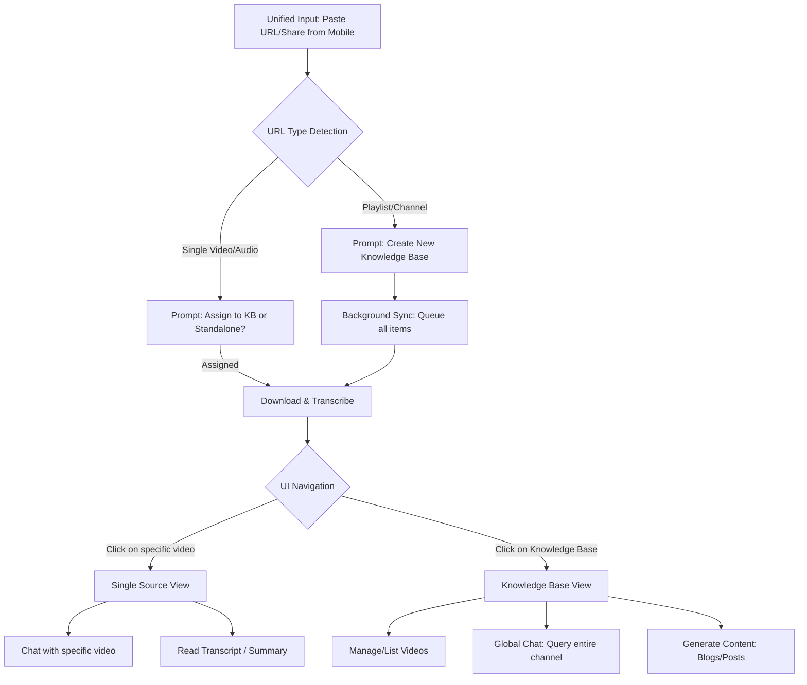

# Omni-Channel Knowledge Base: User Flow & UI Architecture

This plan outlines the conceptual UI layout and user flow to transition the application from a "single-video chat" interface to a comprehensive, multi-source **Knowledge Base System**. It is designed with future mobile app integration (via "Share Intents") in mind.

## Open Questions
> [!IMPORTANT]
> 1. **Batch Processing Limits:** When a user inputs an entire YouTube channel with 500+ videos, should we process them all at once, or only process the latest X videos and paginate the rest?
> 2. **Chat Scope:** Should users be able to select *multiple specific* videos to chat with at once (e.g., ticking checkboxes for 3 videos), or just stick to "Chat with Single Video" vs "Chat with Entire Playlist/Channel"?

---

## 1. Core Hierarchy Level

To support collections (playlists/channels) and individual items seamlessly, the data model and UI hierarchy need to be upgraded to three distinct levels:

1. **Workspaces / Knowledge Bases (Collections)**
   - *Examples:* "Lex Fridman Podcast" (Channel), "React Tutorials" (Playlist), "My Daily News" (RSS Feed).
2. **Sources (Individual Items)**
   - *Examples:* A single YouTube video, a single Spotify podcast episode, an uploaded MP3 file.
3. **Conversations (Chats)**
   - *Examples:* A chat thread querying a single source, or a chat thread querying an entire Knowledge Base.

---

## 2. Global UI Layout (Web App)

### A. Left Sidebar (Navigation & Collections)
- **New / Import Button:** A prominent unified input to paste URLs, upload files, or link RSS feeds.
- **Knowledge Bases (Folders):** A collapsible list of all Playlists, Channels, and Custom Collections.
- **Standalone Sources:** A list for single videos that haven't been assigned to a specific KB.
- **Recent Chats:** Quick access to ongoing conversations.

### B. Main Content Area (Dynamic based on selection)
- **State 1: Input/Importing Screen:** Progress bars showing download/transcription status for bulk imports.
- **State 2: Knowledge Base View:** 
  - **Top:** Meta info (Channel Avatar, Total Videos, Total Hours Transcribed).
  - **Tabs:** `Sources` (List of videos), `Global Chat` (Chat interface for the whole channel), `Extracted Content` (Generated LinkedIn posts, summaries).
- **State 3: Single Source View:** 
  - **Top:** Video Player/Audio Player.
  - **Bottom/Split:** `Transcript` vs `Chat`.

---

## 3. User Flows

### Flow 1: Importing a YouTube Channel or Playlist
1. User clicks **"New Import"** and pastes a YouTube Playlist/Channel URL.
2. System automatically detects the URL type and presents a modal:
   - *Detected:* "Lex Fridman Podcast (300 videos)"
   - *Options:* "Sync Entire Channel" or "Select Specific Videos".
3. A new **Knowledge Base** is created in the sidebar.
4. The user is redirected to the KB View where they see a live progress list of videos being downloaded and transcribed (using background queue).
5. User can immediately start chatting in the "Global Chat" tab, and the system uses whatever transcripts are currently finished.

### Flow 2: Chatting for Comprehensive Knowledge
1. User navigates to the "Lex Fridman Podcast" Knowledge Base.
2. User goes to the **Global Chat** tab.
3. User asks: *"What does he say about dopamine and motivation across his episodes?"*
4. System retrieves relevant chunks from *all* transcribed videos in that channel and answers, citing specific videos/timestamps.

### Flow 3: Mobile App "Share Intent" (Future Proofing)
1. User is watching a video in the native YouTube app on their phone.
2. User taps "Share" and selects our Mobile App.
3. Our app opens an overlay modal (bottom sheet):
   - *"Where would you like to save this video?"*
   - Options: `Add to 'Machine Learning' KB`, `Add to 'Stand-up Comedy' KB`, or `Save as Standalone`.
4. User selects a KB. The video is added to the background transcription queue, and the user is instantly returned to the YouTube app.

---

## 4. Visual Flow Diagram

